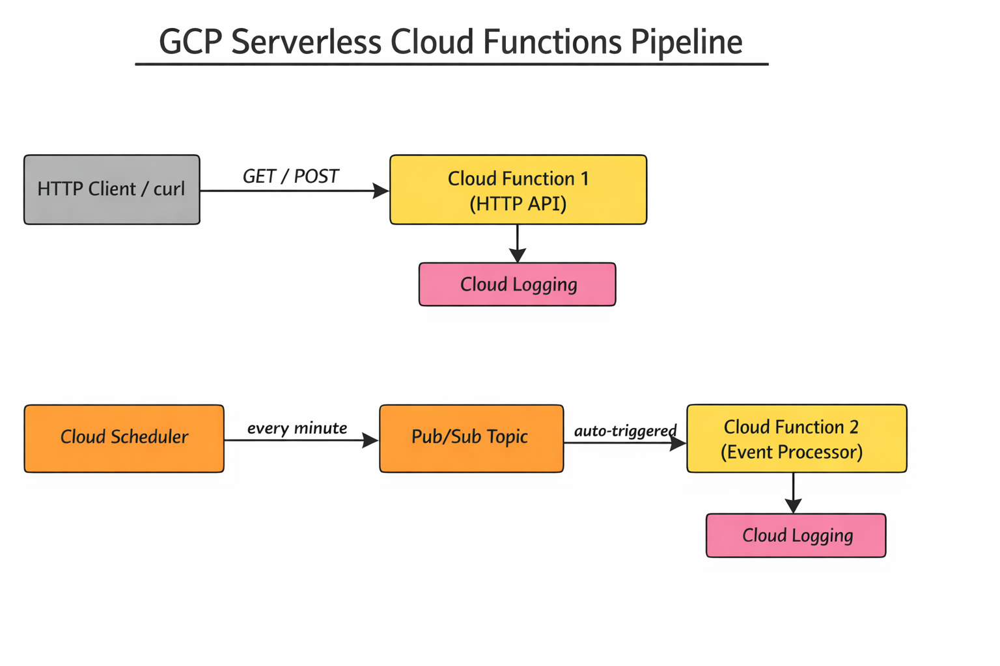

# GCP Serverless Cloud Functions Pipeline

A fully serverless event-driven pipeline on GCP using Cloud Functions,
Pub/Sub, and Cloud Scheduler. Zero servers, zero ops, scales automatically.

## Architecture



**Services Used:**

- Cloud Functions v2 (Python 3.11) — serverless compute
- Pub/Sub — async message queue between functions
- Cloud Scheduler — automated cron-based event triggers
- Cloud Storage — function source code storage
- Cloud Logging — automatic function logging
- Terraform — all infrastructure as code

## Live Demo

▶️ [Watch the full demo on YouTube](https://youtube.com/YOUR_VIDEO_URL)

## How It Works

1. HTTP API function handles GET and POST requests
2. Cloud Scheduler publishes a metric event to Pub/Sub every minute
3. Event Processor function auto-triggers on Pub/Sub messages
4. Everything logged automatically to Cloud Logging

## How to Deploy

```bash
git clone https://github.com/YOUR_USERNAME/gcp-serverless-functions-pipeline
cd gcp-serverless-functions-pipeline/terraform
terraform init
terraform apply
```

## How to Test

```bash
# GET request
curl YOUR_API_URL

# POST request
curl -X POST YOUR_API_URL \
  -H "Content-Type: application/json" \
  -d '{"name": "test", "value": 95}'

# Manually trigger event processor
gcloud pubsub topics publish serverless-pipeline-events \
  --message='{"type": "metric", "value": 95}'
```

## Destroy

```bash
terraform destroy
```

## Cost

Completely free on GCP free tier:

- Cloud Functions: 2M invocations/month free
- Pub/Sub: 10GB/month free
- Cloud Scheduler: 3 jobs/month free

## Skills Demonstrated

- Serverless event-driven architecture
- Cloud Functions (HTTP + Pub/Sub triggers)
- Async messaging with Pub/Sub
- Scheduled jobs (Cloud Scheduler)
- Infrastructure as Code (Terraform)
- CI/CD (GitHub Actions)
- Cloud Logging observability
